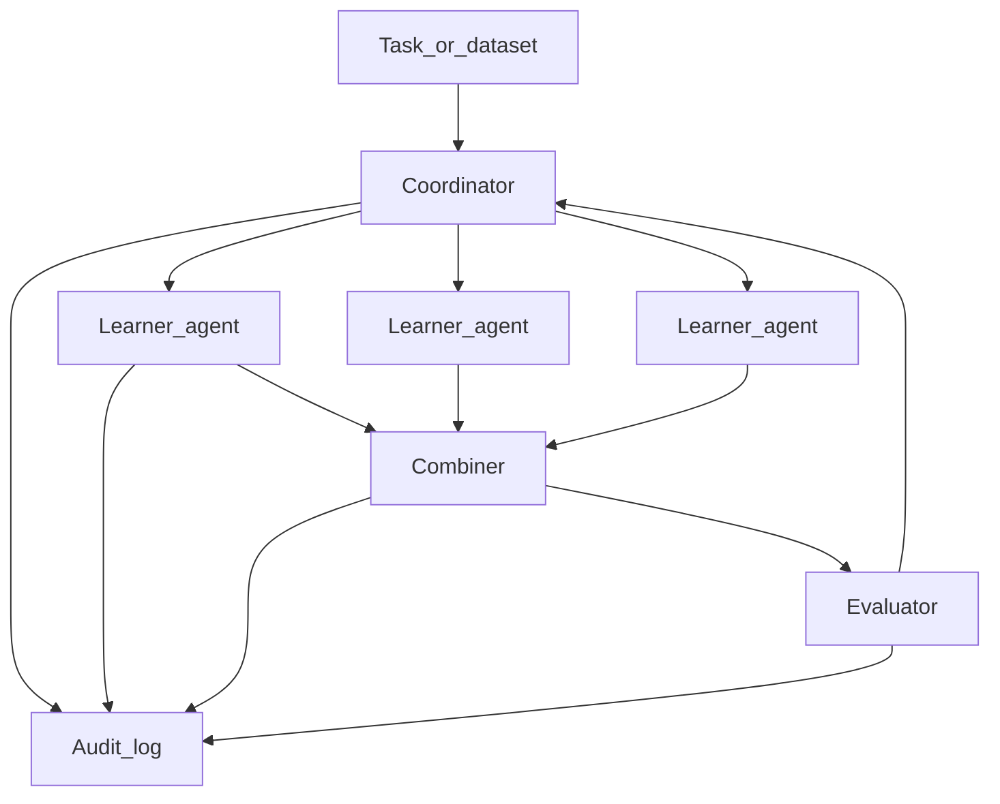

# Agent Architecture (Hybrid)

**Domain:** D31 Ensemble of Agents  
**Used by:** [quarter1.md](quarter1.md), [quarter2.md](quarter2.md) · **Parent:** [curriculum.md](curriculum.md)

## Design principle

Weak learners that affect accuracy are **code agents** (real classifiers). A **coordinator** (optionally LLM-assisted) decides how to spawn, schedule, combine, and evaluate them. Pure-LLM sessions are not used as accuracy-critical base learners.



## Roles

### Learner agent

Trains and predicts with a concrete model (decision stump, tree, logistic regression, etc.).

| Responsibility | Notes |
| --- | --- |
| Accept a train request | Features, labels, optional sample weights, hyperparameters |
| Return a fitted model handle | Serializable artifact or in-memory id |
| Accept a predict request | Features → hard labels and/or scores |
| Report status | Success, failure, metrics on its training slice |

Learners do **not** choose the ensemble strategy; they execute the coordinator’s instructions.

### Coordinator agent

Owns the ensemble protocol.

| Mode | Behavior |
| --- | --- |
| **Q1 bagging** | Spawn `N` learners on bootstrap samples; request predictions; send to combiner (vote) |
| **Q1 AdaBoost** | Sequentially spawn learners with updated example weights; record learner weights `α_t`; send to weighted combiner |
| **Q2 meta** | Choose method menu, `N`, rounds, and combiner; optionally call an LLM for suggestions; **validate** against a schema; fall back to rules if invalid |

The coordinator must emit a structured **decision record** before each action (see [Logging](#logging)).

### Combiner

Aggregates learner outputs: majority vote, soft vote, AdaBoost weighted vote, or (Q2) stacking-like policies chosen by the coordinator.

### Evaluator

Computes holdout or cross-validation metrics and cost proxies (wall time, `#` learner calls, token use if an LLM assisted the coordinator). Returns a metrics bundle the coordinator can use to stop or continue optimization.

## Message types

Use a versioned JSON (or equivalent) schema. Minimum fields:

### `TrainRequest`

```json
{
  "type": "TrainRequest",
  "request_id": "uuid",
  "learner_id": "string",
  "method": "decision_stump|tree|logistic|...",
  "data_ref": "dataset slice or path",
  "sample_weights": "optional array or ref",
  "hyperparams": {}
}
```

### `TrainResult`

```json
{
  "type": "TrainResult",
  "request_id": "uuid",
  "learner_id": "string",
  "model_ref": "string",
  "train_error": 0.0,
  "status": "ok|error",
  "error": null
}
```

### `PredictRequest` / `PredictResult`

```json
{
  "type": "PredictRequest",
  "request_id": "uuid",
  "learner_id": "string",
  "model_ref": "string",
  "data_ref": "string"
}
```

```json
{
  "type": "PredictResult",
  "request_id": "uuid",
  "learner_id": "string",
  "predictions": "labels or path",
  "scores": "optional",
  "status": "ok|error"
}
```

### `CombineRequest` / `CombineResult`

Specifies policy (`majority`, `soft_vote`, `adaboost_weighted`, …), learner weights if any, and prediction refs. Returns ensemble predictions.

### `EvaluateRequest` / `EvaluateResult`

Specifies metrics (`accuracy`, `error`, `f1`, …), split protocol, and cost fields. Returns a metrics object consumed by the coordinator.

### `CoordinatorDecision` (Q2 required; Q1 encouraged)

```json
{
  "type": "CoordinatorDecision",
  "decision_id": "uuid",
  "rationale": "human-readable string",
  "source": "rule|llm|fallback",
  "actions": {
    "methods": ["tree", "logistic"],
    "n_learners": 10,
    "rounds": 50,
    "combiner": "majority",
    "budget": {}
  }
}
```

If `source` is `llm` and schema validation fails, the coordinator must set `source` to `fallback` and apply a documented default policy.

## Protocols

### Bagging (Q1)

1. Coordinator samples `N` bootstrap datasets (or instructs a sampler).
2. Issues parallel `TrainRequest`s to learner agents.
3. Issues `PredictRequest`s on the evaluation or out-of-bag set.
4. `CombineRequest` with majority or soft vote.
5. `EvaluateRequest`; log all messages.

### AdaBoost (Q1)

1. Initialize uniform example weights.
2. For round `t = 1..T`:
   - `TrainRequest` with current weights.
   - Compute weighted error; derive `α_t`.
   - Update example weights; log `α_t` and errors.
3. `CombineRequest` with AdaBoost weighted vote.
4. `EvaluateRequest`; compare learning curves to sklearn.

### Meta-optimization (Q2)

1. Ingest task schema (features, labels, split, budget).
2. Emit `CoordinatorDecision`.
3. Run selected bagging/boosting/other protocol via the same learner APIs.
4. `EvaluateRequest`; if budget remains and metrics warrant, emit a new decision (change methods, `N`, rounds, or combiner) and repeat.
5. Stop on budget exhaustion or plateau criteria defined in the proposal.

## Logging

- Append-only **audit log** of every message and `CoordinatorDecision`.
- Include timestamps, `request_id`s, random seeds, and software versions.
- Q1 reports and Q2 showcases must be regenerable from the log plus frozen code/data refs.

## Implementation notes

- Prefer process- or thread-isolated learners so bagging parallelism is real, not only conceptual.
- Keep the LLM (if any) **outside** the predict path of base learners.
- Lock these interfaces by the end of Q1 week 2; Q2 week 1 is an API freeze, not a redesign.
