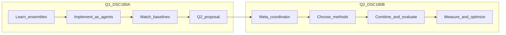

# Curriculum: Ensemble of Agents (D31)

**Mentor:** Yoav Freund · [yfreund@ucsd.edu](mailto:yfreund@ucsd.edu)  
**Domain:** D31 · up to 4 students · ~1 mentor hour per week  
**Sequence:** DSC 180A (Fall 2026) → DSC 180B (Winter 2027)

This curriculum implements the domain described in [description.md](description.md) within the program structure of [overview.md](overview.md). Detailed schedules live in [quarter1.md](quarter1.md) and [quarter2.md](quarter2.md); agent interfaces are specified in [agent-architecture.md](agent-architecture.md).

## Defaults

| Choice | Decision |
| --- | --- |
| Q1 replication path | Bagging first (parallel agents), then AdaBoost (sequential coordination / reweighting), matched against sklearn baselines |
| Agent model | **Hybrid** — weak learners are code agents (real classifiers); a coordinator agent (LLM-assisted) spawns, combines, and evaluates them. Pure-LLM “learners” are out of scope for accuracy-critical paths |
| Q2 scope (v1) | Tabular classification only |
| Team workflow | Shared repo; asynchronous work; weekly mentor check-in focused on demos and decisions |

## Throughline

**Q1 question:** Can classical ensemble algorithms be realized as communicating agents without losing correctness or accuracy vs. standard implementations?

**Q2 question:** Can a coordinator agent *decide for itself* which base methods to use, how to combine them, and how to measure/optimize performance on new tasks?

## Quarter 1 (DSC 180A) — Learn, implement, replicate

**Goal:** Build background in ensemble methods and agent systems. The **Quarter 1 Project** replicates bagging and AdaBoost as agent architectures. The quarter ends with a **Quarter 2 proposal**.

**Success criteria**

- Correct agent protocols for bagging (parallel) and AdaBoost (sequential).
- Accuracy / error curves within a small tolerance of sklearn (or documented, justified gaps).
- Clear logs of agent messages and coordinator decisions (audit trail).
- Short report: methods, architecture diagrams, results, limitations.
- Q2 proposal covering the general-purpose loop, evaluation suite, non-goals, and reuse of Q1 interfaces.

See [quarter1.md](quarter1.md) for the week-by-week schedule and report rubric.

## Quarter 2 (DSC 180B) — Self-configuring agent ML system

**Goal:** Build a **general-purpose agent-based ML application** that chooses methods, combinations, and an optimization strategy for new tasks—without hand-tuned per-task code.

**Success criteria**

- On held-out tasks, the system selects a configuration and matches or beats fixed AdaBoost/bagging baselines on aggregate metrics.
- Transparent decision traces explaining method, combiner, and budget choices.
- Reproducible runs and an honest limitations section.

See [quarter2.md](quarter2.md) for the week-by-week schedule and deliverables.

## Mentoring cadence

About one hour per week. Meetings rotate among: paper discussion, design review, live demo of an agent run, results critique, and proposal / showcase feedback. Students own the repository; meetings are not lectures.

## Risks to manage early

- **Scope creep** on “general purpose” — keep Q2 v1 to tabular classification.
- **LLM coordinator flakiness** — require deterministic fallbacks and logged rationales.
- **Limited mentor bandwidth** — prepare demos and decisions before the weekly meeting.
- **Team size** — curriculum assumes up to 4 students; it still works with 3.

## Related documents

- [description.md](description.md) — domain pitch and classic references
- [overview.md](overview.md) — program-level Q1 / Q2 structure
- [quarter1.md](quarter1.md) — Fall schedule and milestones
- [quarter2.md](quarter2.md) — Winter schedule and deliverables
- [agent-architecture.md](agent-architecture.md) — learner / coordinator / evaluator interfaces
