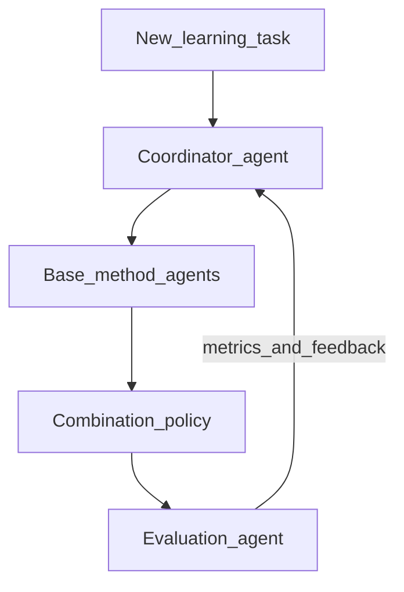

# Quarter 2 (DSC 180B): Self-Configuring Agent ML System

**Term:** Winter 2027 · **Domain:** D31 Ensemble of Agents  
**Parent doc:** [curriculum.md](curriculum.md) · **Architecture:** [agent-architecture.md](agent-architecture.md)  
**Prerequisite:** Q1 report and Q2 proposal from [quarter1.md](quarter1.md)

## Goal

Execute the **Quarter 2 Project**: a general-purpose agent-based machine learning application that, given a new tabular classification task, **decides for itself** which base methods to use, how to combine them, and how to measure and optimize performance—reusing the hybrid agent stack from Q1.

## System requirements

| Component | Responsibility |
| --- | --- |
| **Coordinator** | Selects base methods (e.g. stump, tree, logistic, small NN), budget (`#agents`, rounds), and combination rule (vote, weighted vote, stacking-like). May be LLM-assisted with **deterministic fallbacks**. |
| **Base method agents** | Q1-style code workers; expanded method library allowed. |
| **Combination policy** | Aggregates predictions according to the coordinator’s choice. |
| **Evaluation agent** | Holdout / CV metrics, optional calibration, cost (time, tokens, `#` agent calls); feeds metrics back to the coordinator. |
| **Optimization loop** | Improve under explicit budget constraints across rounds. |

**Hard constraints for v1**

- Tabular classification only.
- No hand-tuned per-task code paths in the final evaluation (configuration must come from the coordinator).
- Every coordinator decision is logged in a human-readable trace.
- Pure-LLM models are not used as accuracy-critical base learners.

## Week-by-week schedule

| Week | Theme | Focus | Deliverable |
| --- | --- | --- | --- |
| 1 | Architecture freeze | Lock Q1 APIs; define task schema and metrics; freeze proposal non-goals | API freeze doc; task schema |
| 2 | Architecture freeze | Choose 3–5 benchmark tasks (vary size / noise / imbalance); wire evaluation harness | Benchmark suite + baseline scripts |
| 3 | Meta-coordinator v1 | Fixed menu of methods and combiners; rule- or LLM-based selection | Coordinator v1 choosing among menu |
| 4 | Meta-coordinator v1 | End-to-end run on all benchmarks; compare to fixed AdaBoost / bagging | First aggregate scoreboard |
| 5 | Meta-coordinator v1 | Fix failures; require fallbacks when LLM output is invalid | Reliable v1 that beats or matches baselines *on average* |
| 6 | Optimization loop | Iterative improve-under-budget (more rounds, swap learners, reallocate agents) | Optimization loop MVP |
| 7 | Optimization loop | Ablations: what the coordinator may change; cost vs. accuracy curves | Ablation report section |
| 8 | Hardening | Reliability, seeds, failure modes, decision-trace UX | Repro checklist passing |
| 9 | Hardening | Polish demo; draft final report and showcase materials | Report draft; demo script |
| 10 | Showcase | Final system, report, and demo | **Final deliverables** due |

Align dates with the official DSC 180B / showcase calendar.

## Milestones

1. **M1 (end of week 2):** APIs, task schema, and benchmark suite locked.
2. **M2 (end of week 5):** Meta-coordinator v1 meets aggregate baseline criterion.
3. **M3 (end of week 7):** Optimization loop and ablations complete.
4. **M4 (end of week 10):** Final system, report, and showcase demo.

## Proposal template checklist (carry forward from Q1)

Confirm the Q1 proposal still holds, or amend explicitly:

- [ ] Loop: task → select methods → combine → measure → optimize
- [ ] Evaluation suite (3–5 tasks) listed with rationale
- [ ] Non-goals stated
- [ ] Q1 interface reuse mapped (learner / coordinator / evaluator)
- [ ] Success metric vs. fixed AdaBoost and bagging baselines
- [ ] Budget definition (wall time, `#` learners, rounds, token cap if any)

## Q2 success criteria

- On held-out tasks, the system chooses a configuration **without hand-tuned per-task code** and **matches or beats** fixed ensemble baselines on aggregate metrics.
- Transparent decision traces: why methods, combiner, and budget were chosen.
- Reproducible runs and a clear limitations section (what the coordinator still decides poorly).

## Final deliverables

| Deliverable | Description |
| --- | --- |
| Running system | Repo that accepts a tabular task and runs the full coordinator loop |
| Decision traces | Logged rationales for method/combiner/budget choices |
| Evaluation report | Aggregate vs. baselines; ablations; cost/accuracy tradeoffs |
| Showcase materials | Demo script and short presentation aligned with [dsc-capstone.org/showcase-26](https://dsc-capstone.org/showcase-26) expectations |
| Limitations | Honest account of failure modes and out-of-scope cases |

## Final report rubric

| Section | What to include | Weight (guide) |
| --- | --- | --- |
| Vision & related work | Link to Q1; how agents enable self-configuration | 10% |
| System design | Architecture, APIs, fallbacks, logging | 20% |
| Method | Coordinator policy, method menu, optimization loop | 20% |
| Experiments | Benchmarks, baselines, aggregate results, ablations | 30% |
| Discussion & limitations | What works, what does not, next steps | 10% |
| Reproducibility & demo | How to run; showcase readiness | 10% |

## Weekly mentoring focus

| Weeks | Typical meeting agenda |
| --- | --- |
| 1–2 | API and benchmark freeze decisions |
| 3–5 | Demo coordinator v1; critique scoreboard |
| 6–7 | Optimization and ablation review |
| 8–10 | Hardening, report, and showcase dry run |
